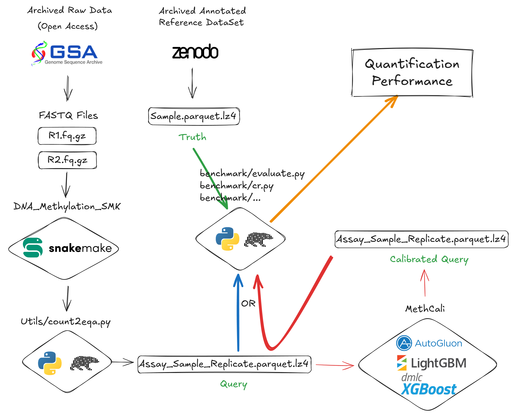
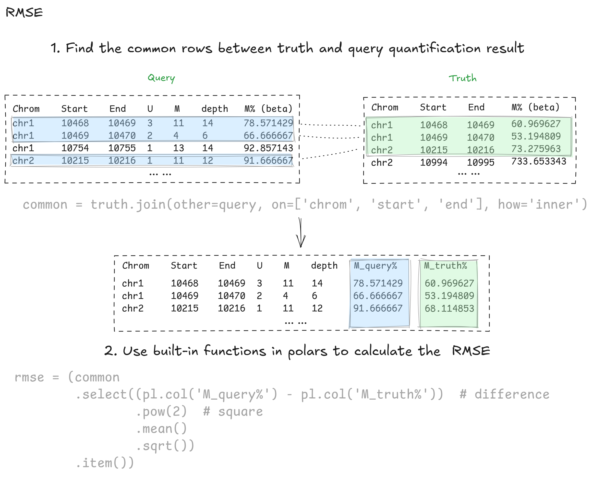
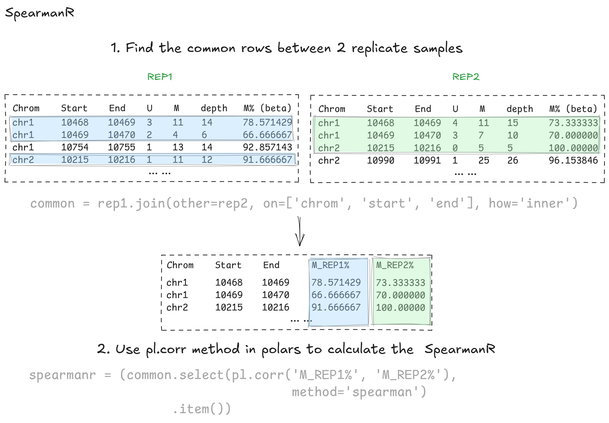

# dna_methylation_smk
Snakemake pipelines to run NGS-based methylation analysis and benchmark.
The python script and .ipynb files to reproduce the benchmarking results, including evaluation and statistical analysis, are in the `benchmark` folder.

The scripts for data visualization are listed in `benchmark/figures` folder.

Following is a simplified schematic diagram involving the dna_methylation_smk and MethCali:


Here is the way to calculate the RMSE and SpearmanR:



Please read the `benchmark/README.md` for more details.

## Requirements
While the snakemake and python scripts are compatible with most operating systems, there are many bioinformatic tools evaluated here only work on x64 Linux. Please use a x64 Linux server / container with at least 128GB RAM and 8 CPU cores to run the pipelines.

## Installation
1. Install [miniforge](https://github.com/conda-forge/miniforge) following the instructions on the github page.
2. Create a conda environment with [snakemake](https://snakemake.readthedocs.io/en/stable/getting_started/installation.html) following the instructions.
3. Clone this git repo with submodules:
    ```bash
    git clone https://github.com/YuanfengZhang/dna_methylation_smk --recurse-submodules
    ```
4. Install and compile the third-party tools, including abismal, aryana, BatMeth2, bsgenova, FAME, gem3-mapper, hisat2, hisat-3n, last-split-pe, Msuite2, pufferfish, rastair, Whisper, BioSeqZip, ngsreadstreatment, TrieDedup, CARE, and so on.
5. Modify the `config/runtime_config.yaml` to set the paths of the files and parameters required by third-party tools.

# TODO: Add a script to automatically install and compile the third-party tools in step 4, 5.

6. Fill the sample sheet csv file according to the format described in `utils/sample_sheet_parser.py` and `config/sample_sheet.csv`.
7. Run the snakemake pipelines, e.g.:
    ```bash
    snakemake --snakefile fq2bedgraph.smk --config sample_sheet=config/sample_sheet.csv --cores 32 --printshellcmds --use-conda --keep-incomplete --keep-going --nolock --rerun-triggers mtime --benchmark-extended
    ```
8. Use the scripts in `benchmark` to reproduce the benchmarking results.
